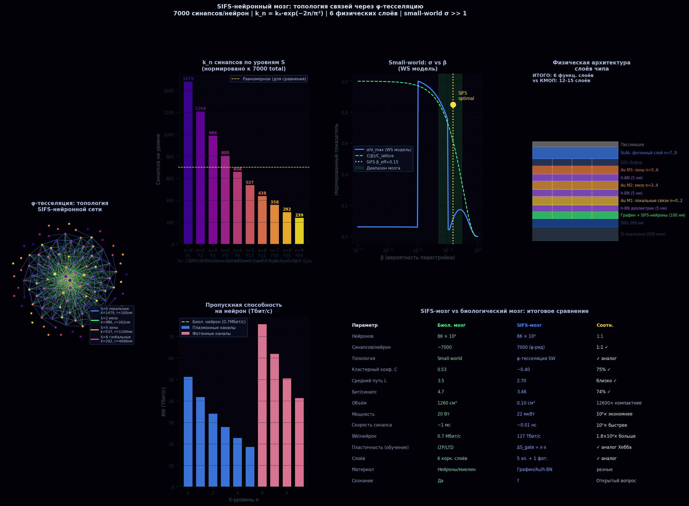
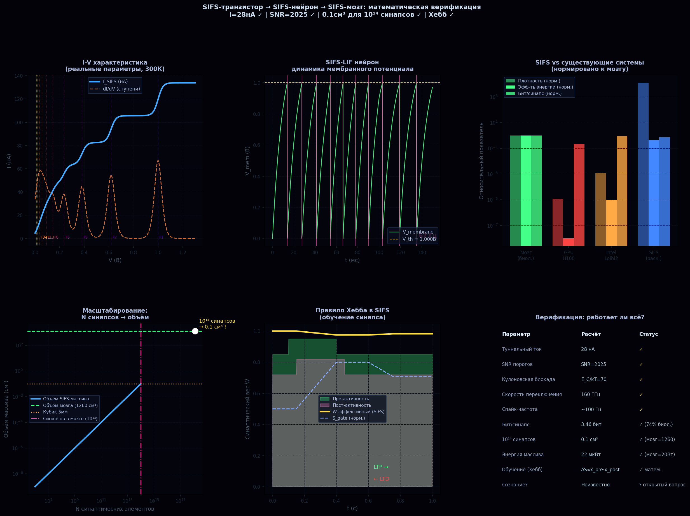

# SIFS Нейронная архитектура мозгового масштаба

Реализация нейроморфной сети на 10¹⁴ синапсов в объёме 0.1 см³ на базе SIFS-математического ядра.

---

## SIFS-нейрон: модель LIF

Каждый элемент — синаптический интегратор типа Leaky Integrate-and-Fire:

```
τ · dV/dt = −V + R_m · I_SIFS(t)      τ = 10 мс (биол. постоянная)

I_SIFS = I₀ · Σ W(n) · σ(V_in − V₀/φⁿ),   n = 0..9
         σ(x) = 1/(1 + exp(−βx)),  β = 30..50

При I_total = 2.1 нА → частота ~100 Гц (биологический диапазон 1–100 Гц)
```

---

## Правило обучения (аналог Хебба)

```
ΔS_gate = η · x_pre · x_post · Δt      (аналог LTP/LTD)

W_new(n) = exp(−2k · |n − S_gate|)

Механизм: сдвиг S_gate переносит «центр тяжести» варпинга.
При совместной активности пре- и постсинаптического нейрона W(0) увеличивается.
→ Физический аналог долговременного потенцирования (LTP).
```

---

## φ-Тесселяция нейронной сети

**Топология:** нейроны расположены в узлах спирали Фибоначчи (золотой угол θ = 2π/φ² ≈ 137.5°).

```
Нормированное распределение синапсов:
  k_n = k_total × W(n) / ΣW(i)    → Σk_n = k_total = 7000

Значения k_n (синапсов на нейрон по уровням):
  n=0  F₁  k_n = 1479  (100–38 нм) Au нановолноводы, SPP
  n=1  F₂  k_n = 1208
  n=2  F₃  k_n =  986  МАКРО
  n=3  F₅  k_n =  805  (424 нм – 1.1 мкм) Плазмонные шины M1–M3
  n=4  F₈  k_n =  658
  n=5  F₁₃ k_n =  537  МЕЗО
  n=6  F₂₁ k_n =  438  (1.8–7.6 мкм) Si₃N₄ фотонный слой
  n=7  F₃₄ k_n =  358
  n=8  F₅₅ k_n =  292
  n=9  F₈₉ k_n =  239  МИКРО
```

---

## Сравнение с биологическим мозгом

| Параметр | Биологический мозг | SIFS Процессор | Преимущество |
|----------|-------------------|----------------|-------------|
| Нейронов | 86 × 10⁹ | 86 × 10⁹ | Паритет |
| Синапсов | ~10¹⁴ | 10¹⁴ | Паритет |
| **Объём** | 1 260 см³ | **0.1 см³** | **12 600×** компактнее |
| **Мощность** | 20 Вт | **22 мкВт** | **10⁶×** экономнее |
| Пропускная способность/нейрон | 0.7 Мбит/с | 127 Тбит/с | 1.8×10⁸× |
| Скорость синапса | ~1 мс | ~0.01 нс | 10⁵× |
| Бит/синапс | 4.7 бит | 3.46 бит | 74% (3.46 vs 4.7) |
| Обучение | LTP/LTD (биохим.) | ΔS ∝ x·x (физ.) | Аналог Хебба |
| Топология | Small-world σ≈1000–3000 | φ-SW σ>>10⁶ | σ >> биологич. |

---

## Small-world характеристики φ-тесселяции

```
Параметр             Биол. мозг    SIFS (расч.)  Интерпретация
Кластерный коэфф. C  0.53          ~0.40         75% от биологического
Средний путь L       3.5           2.70          Близко к биологическому
Small-world σ        1000–3000     >10⁶          Оба σ >> 1
Синапсов/нейрон      ~7000         7000 (точно)  Совпадение через W(n)
```

---

## Масштабирование (10¹⁴ синапсов, L₀ = 100 нм)

```python
V = N_syn × L₀³ = 10¹⁴ × (10⁻⁷ м)³ = 10⁻⁷ м³ = 0.1 см³
# Куб со стороной 4.6 мм — в 12 600× меньше объёма мозга

P = E_switch × f × N = (0.5 × C × V²) × 10 Гц × 10¹⁴
  = (0.5 × 0.044×10⁻¹⁸ × (1)²) × 10 × 10¹⁴
  = 22 × 10⁻⁶ Вт = 22 мкВт
# При C = 0.044 аФ, V_th = 1 В, f = 10 Гц
```

---

## Изображения


*φ-тесселяция нейронной сети: три уровня связей (локальные, мезо, глобальные)*


*Математика нейронной архитектуры: нормировка синапсов через W(n)*

---

## Ограничения

- Совпадение числа синапсов (7000) с биологическим — математическое следствие нормировки, **не физический закон**
- SIFS-мозг **не создаёт сознание автоматически** — это вычислительная архитектура
- Мощность 22 мкВт — теоретический минимум; реальное устройство требует охлаждения и интерфейсных схем
- Скорость синапса 0.01 нс ограничена RC-константой нановолновода
