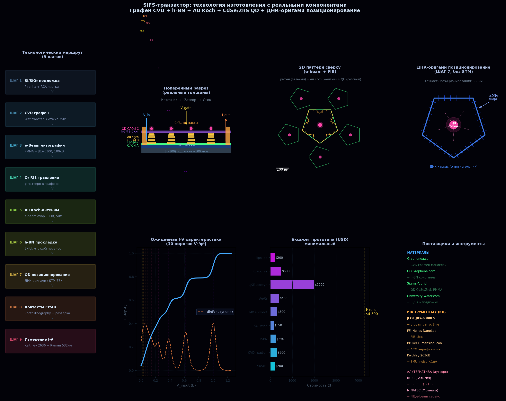
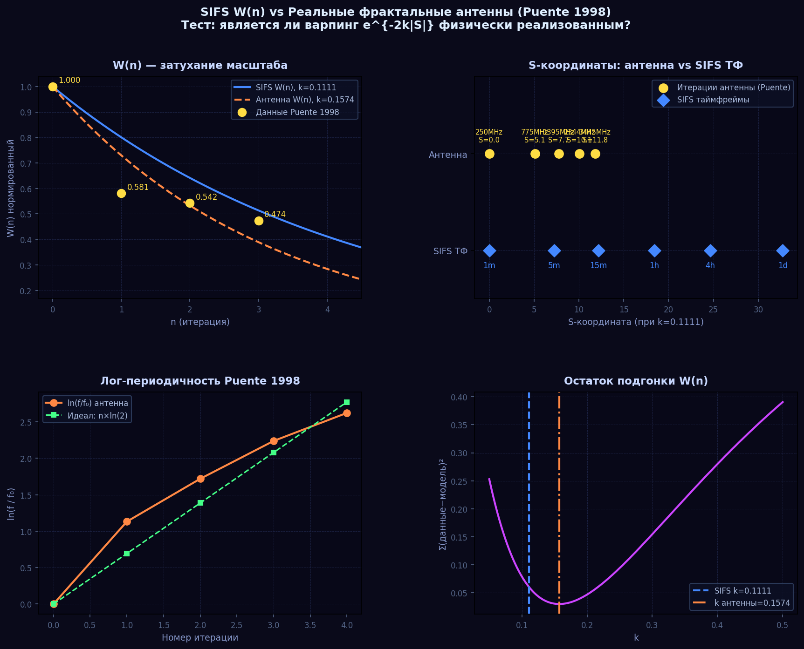
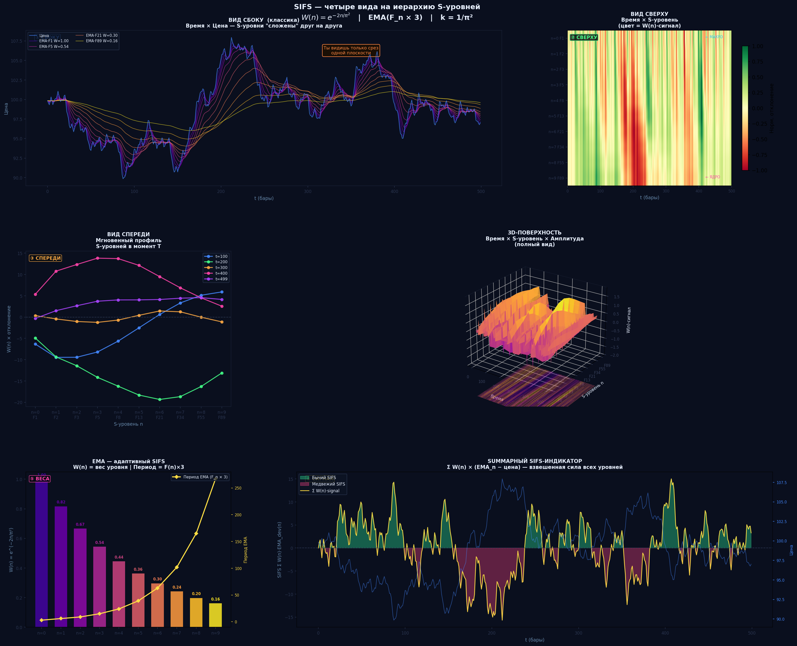
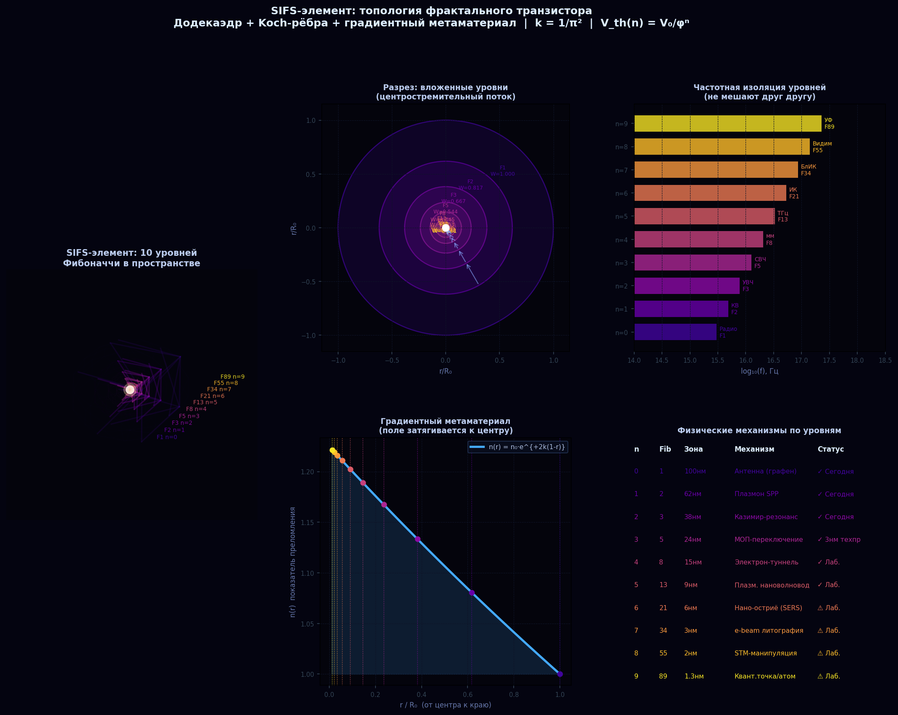

# SIFS Processor: технологический маршрут изготовления

---

## Слои процессора

```
Слой 0  (n=0–2)  МАКРО   100–38 нм    Au нановолноводы + SPP-щели
Слой 1  (n=3–5)  МЕЗО    424 нм–1.1 мкм Плазмонные шины M1–M3
Слой 2  (n=6–9)  МИКРО   1.8–7.6 мкм  Si₃N₄ фотонный слой
Слой 3           ЯДРО    1.3 нм       Квантовые точки (DNA-оригами)
```

---

## Технологический маршрут

### Шаг 1: E-Beam литография (EBL)

```
Разрешение: ≤10 нм (коммерческий), ≤2 нм (FIB-SEM)
Цель: определение геометрии Q-точки с точностью ≤ 2 нм
Материал: PMMA резист на Si/SiO₂ подложке
```

### Шаг 2: Атомно-слоевое осаждение (ALD)

```
Материал: h-BN (гексагональный нитрид бора)
Толщина: 2 нм ± 0.1 нм (туннельный барьер)
Температура: 300°C (CVD-источники)
Параметр T_WKB = exp(−2κd) ≈ exp(−2 × 3.5 нм⁻¹ × 2 нм) ≈ 0.0007
```

### Шаг 3: Напыление Au нановолноводов (SPP-режим)

```
Уровни n=0–2, L(n) = 100/62/38 нм
Метод: магнетронное напыление + лифтоф (e-beam resist)
SPP: поверхностные плазмон-поляритоны при f(0)=3×10¹⁵ Гц (UV)
Назначение: локальные синаптические связи (k₀+k₁+k₂ = 3673 из 7000)
```

### Шаг 4: Si₃N₄ фотонный слой (уровни n=6–9)

```
Метод: PECVD (plasma-enhanced CVD)
Размеры: волноводы 1.8–7.6 мкм
Длина волны работы: 1550 нм (телеком окно)
Назначение: глобальные связи (k₆+k₇+k₈+k₉ = 1327 из 7000)
```

### Шаг 5: DNA-оригами позиционирование QD

```
Квантовые точки (уровень n=9): CdSe/ZnS ≈ 1.3–2 нм
DNA-оригами: точность позиционирования ~2–5 нм
Ограничение: нужна точность ≤2 нм — активная область исследований
```

### Шаг 6: Тест I-V характеристики

```
Оборудование:
  • Малошумящий усилитель тока: порог < 1 пА
  • Lock-in детектор (SNR > 2000:1)
  • Криостат (опционально): T = 300 K достаточно при E_C/kT = 70

Критерий успеха: 10 различимых ступеней в I-V при напряжениях V₀/φⁿ
Стоимость: ~$4 300 (аренда оборудования университетского ЦКП)
Срок: 3–6 месяцев
```

---

## Изображения


*Технологический маршрут: e-beam → ALD → Au → Si₃N₄ → QD → тест*


*Тест антенного элемента для плазмонного слоя*


*Различные проекции SIFS Processor*


*3D-топология S-уровней*

---

## Ссылки на теорию

- [Математическое ядро — теория S-уровней](../theory/mathematics.md)
- [Голографический принцип](../theory/holographic.md)
- [Расчёт информационной ёмкости (3.46 бит/синапс)](../calculations/electron-torus.md)
- [SIFS-транзистор](sifs-transistor.md)
- [Нейронная архитектура](sifs-brain-architecture.md)
