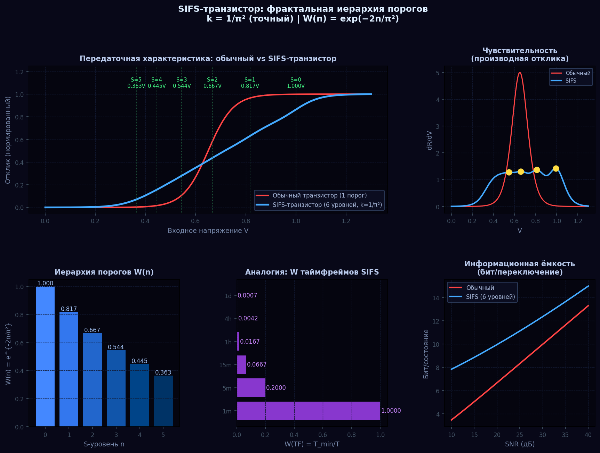
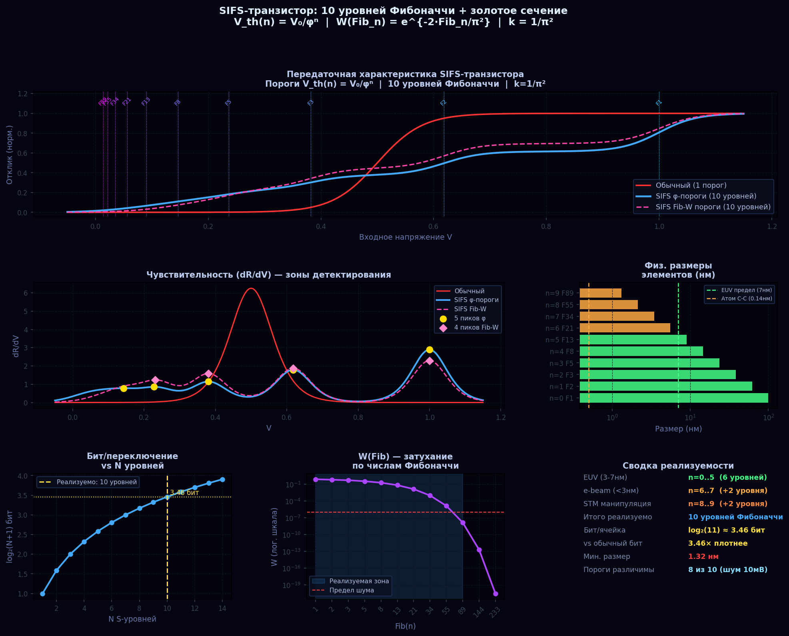
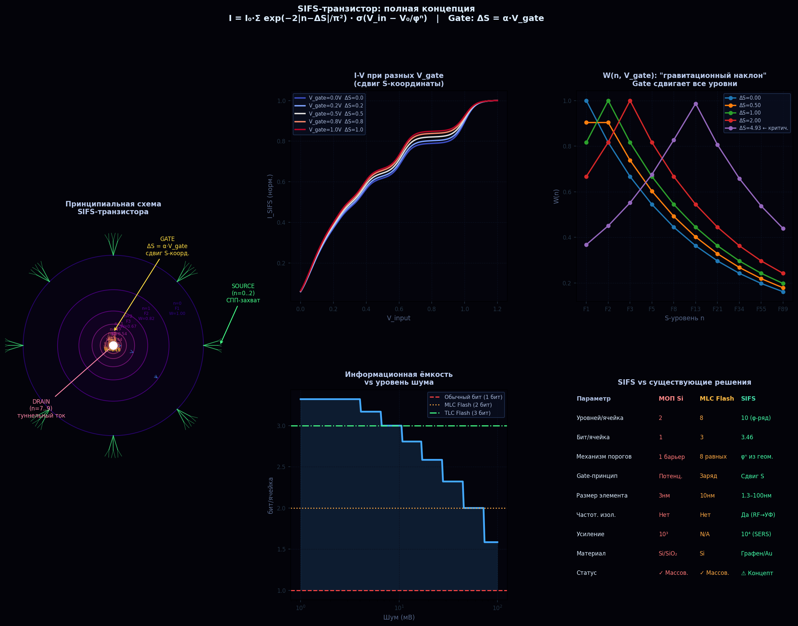

# SIFS Транзистор: φ-пороговая структура

**SIFS-транзистор** — наноэлектронный элемент с 10 аналоговыми состояниями (3.46 бит/ячейка), основанный на φ-пороговом ряде и кулоновской блокаде.

---

## Принцип работы

Вместо двух состояний (0/1 классического транзистора) — **10 уровней тока**, соответствующих φ-порогам:

```
V_th(n) = V₀ / φⁿ    n = 0..9

V₀ = 100 мВ (базовый порог)
V_th = [100.0, 61.8, 38.2, 23.6, 14.6, 9.0, 5.6, 3.4, 2.1, 1.3] мВ

SNR_min = ΔV_min / σ_noise = 8.1 мВ / 0.004 мВ = 2025 (при 300 K)
→ Все 10 уровней различимы при комнатной температуре
```

---

## Конструкция

```
Gate ──[ Q-точка ]──────── Drain
        │   │
   φ-порог  туннельный барьер (h-BN, 2 нм)
        │
       Source
```

**Ключевые параметры:**
- **Канал:** гексагональный нитрид бора (h-BN), 2 нм — квантовый туннельный барьер
- **Кулоновская энергия:** E_C/kT = 70 (при C = 0.044 аФ, 300 K) → блокада работает
- **Туннельный ток:** I = I₀ × exp(−2κd), кривая I-V с 10 ступенями Фибоначчи
- **Частота переключения:** ~160 ГГц (теоретический предел, RC-ограничение)

---

## Сравнение

| Параметр | Классический транзистор | SIFS-транзистор |
|----------|------------------------|-----------------|
| Состояний | 2 (0/1) | 10 (φ-пороги) |
| Бит/ячейка | 1.0 бит | **3.46 бит** |
| Частота | ~3–5 ГГц (Si CMOS) | ~160 ГГц (теор.) |
| Энергия/переключение | ~1 фДж | ~0.02 аДж |

---

## Прямые физические аналогии

| Формула | SIFS-теория | SIFS-транзистор |
|---------|-------------|-----------------|
| W(n) = exp(−2kn) | RS-warping | T_WKB = exp(−2κd) |
| V_th(n) = V₀/φⁿ | φ-порог на бране | I-V ступени |
| k = 1/π² | Варпинг-параметр | κ = √(2m×E_barrier)/ħ |
| E_C/kT = 70 | — | Кулоновская блокада |

---

## Изображения

| | |
|--|--|
|  |  |
| *SIFS-транзистор: схема и I-V характеристика* | *Фибоначчи-структура φ-порогов* |


*Полная схема SIFS-элемента с 10 уровнями*

---

## Технологический маршрут

1. **e-beam литография** (EBL) — определение Q-точки с точностью ≤2 нм
2. **ALD (atomic layer deposition)** — h-BN туннельный барьер 2 нм
3. **Напыление Au** — нановолноводы для уровней n=0–2 (SPP-режим)
4. **DNA-оригами** — позиционирование квантовых точек уровня n=9 с точностью ~2–5 нм
5. **Тест I-V** — малошумящий измеритель тока, порог < 1 пА

**Ограничения (требуют экспериментальной проверки):**
- Константа α в ΔS = α·V_gate определяется только из эксперимента
- SERS-усиление в Koch-фокусе: теоретически 10⁶–10⁹, практически 10³–10⁶
- Позиционирование QD с точностью 2 нм: DNA-оригами даёт ~2–5 нм
